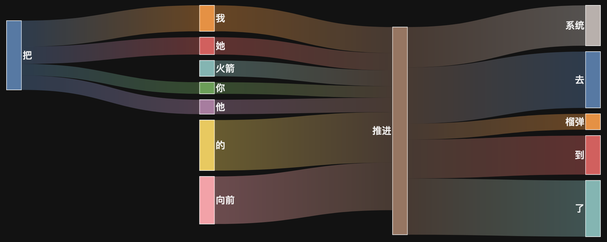
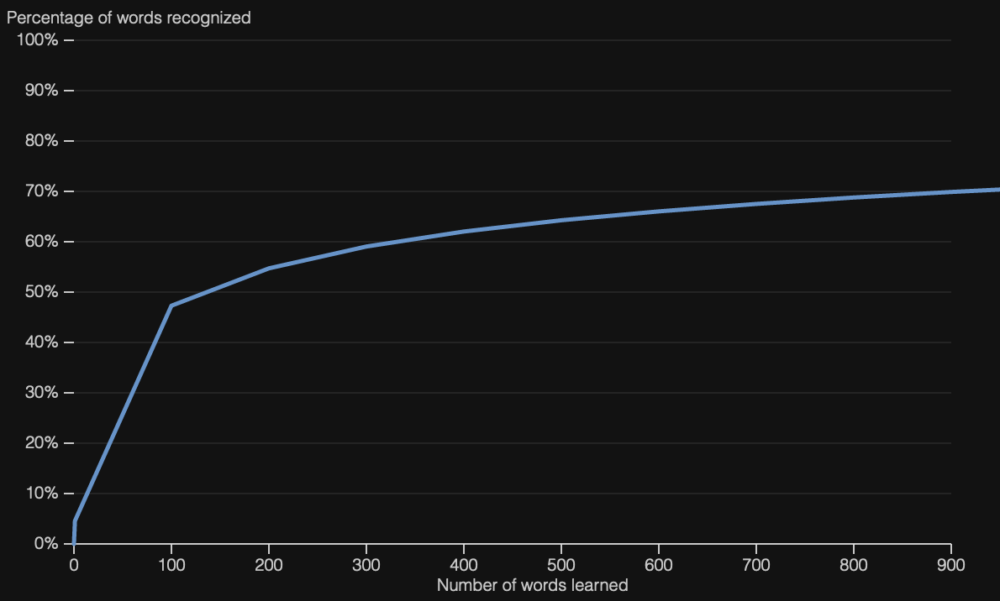

# FreqBurger

## What is this?

FreqBurger is intended to help language learners study and discover new words in context.

It helps learners build words into phrases, and phrases into sentences. It emphasizes a few
different language learning tools, word frequency foremost among them.

It's currently available in [French](https://freqburger.com/french/parle), [Japanese](https://freqburger.com/japanese/%E6%8C%87%E5%B0%8E), [Chinese](https://freqburger.com/chinese/%E7%85%A7%E9%A1%BE),
[Spanish](https://freqburger.com/spanish/siguiente), [German](https://freqburger.com/german/schnell), and [Italian](https://freqburger.com/italian/bisogno).

It's a bit of a prototype, but you can [feel free to check it out](https://freqburger.com/),
or read on for more details.

### Word Frequency

Everything shown on the site is intended to keep word frequency in mind. The sentences are sorted
based on average word frequency ranks. The sankey flow diagrams show only the most common ngrams of
lengths 2 and 3. The lists of collocations are sorted based on how many datasets they were ranked highly
in, and by how often they occurred overall.

Note that frequency is separated by dataset. When learning a new word, it is meaningful that it is more
common in movies than on Wikipedia, for example, and the tool attempts to recognize that.

#### Registers

The site separates sentences by dataset as a proxy for [register](https://en.wikipedia.org/wiki/Register_(sociolinguistics)). As a learner, it is important to me what source a sentence came from. Like the sentence above,
if a word is more common on Wikipedia than in movies, that is meaningful; learners trying to consume native
TV content might want to prioritize the latter, while readers might prioritize the former.

### Visualizations

In addition to sorting sentences by word frequency, the tool provides visualizations to understand how common the word is,
and the words that are most commonly used together. 

It does this via sankey flow diagrams to understand what words commonly come before and after the chosen word; and line graphs for frequency, such that a user can understand how much coverage of a dataset they'd get by learning the words more common than their chosen word. 

In the sankey case, the diagram shows only the 6 most common 2-word collocations and the 6 most common 3-word collocations to reduce clutter. The user can also quickly find example sentences using the collocations in the diagram.

The frequency diagrams attempt to show how much of the language a user could understand by learning in order of frequency up to the searched word, with the expectation that in most languages the top few thousand words account for an outsized proportion of words used.

## Naming

A lot of the other names I considered were taken. Freq is short for frequency, which informs all the data
shown to a user, and burger is...well, a word wrapped in an ngram wrapped in a sentence is kind of like a
sandwich, I guess?

## Technical Considerations

The site is built in plain JavaScript, with a firestore backend. D3 generates the visualizations.

The files in `scripts/` process raw data from the sources listed in the acknowledgements; the files in `firebase/` load the processed data into firestore; frontend code is all in `public/`.

While a system like ElasticSearch would likely be a better fit, a simple key-value pair store is 
used for simplicity (for now). This is aided by the fact that the total number of words and ngrams
in a given language is generally quite manageable; and by the fact that languages tend to evolve
relatively slowly.

## Acknowledgements

The datasets that were used for language data are:

* [Tatoeba](https://tatoeba.org/), which provides a crowdsourced corpus.
* [OpenSubtitles](http://www.opensubtitles.org/), accessed on [opus](https://opus.nlpl.eu/OpenSubtitles2018.php).
* [CommonCrawl](http://www.statmt.org/cc-aligned/), accessed on [opus](https://opus.nlpl.eu/CCAligned.php).
* Aligned [Wikipedia](http://www.sciencedirect.com/science/article/pii/S2212017314005453) translations, accessed on [opus](https://opus.nlpl.eu/Wikipedia.php)
* The dictionaries on [kaikki](https://kaikki.org/)
* [CEDICT](https://cc-cedict.org/editor/editor.php), which releases data under [CC BY-SA 4.0](https://creativecommons.org/licenses/by-sa/4.0/). Because of sharealike, the Chinese definitions content should be considered released under that license as well.

Tatoeba is licensed under [CC-BY 2.0 FR](https://creativecommons.org/licenses/by/2.0/fr/). The kaikki data is made available under the same licenses as Wiktionary (CC-BY-SA and GFDL). See [the Wiktionary copyright page](https://en.wiktionary.org/wiki/Wiktionary:Copyrights) for more information.

## Project Status

The project is a prototype, and under development.

### Known Issues

* Privileging word frequency ranks can favor sentences with typos or grammatical errors, like if a less-common form is replaced with a more-common one (imagine replacing making a typo and replacing `tea` with `the` or something in English).
* More content moderation, including further screening for offensive content, is needed. A rudimentary blocklist has already been applied, but it's not perfect.
* More filtering of junk words and characters is needed.
* Improving the sankey diagrams (with more paths, perhaps) is another potential work item.
* General code cleanup, tests, etc. would be desirable.
